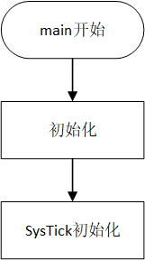
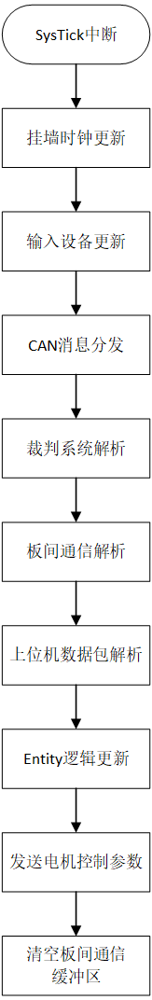
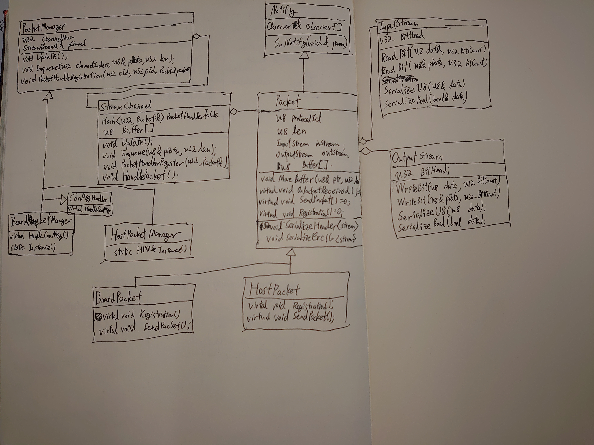

# RobotEngine

RobotEngine是针对RoboMaster比赛所编写的嵌入式代码框架，致力于快速开发与可复用性，已在RoboMaster开发板A型和基于STM32F405VGT6的自制主控板上通过测试。仅供南方科技大学Artinx机器人战队使用，外传前请获取作者许可。

## 特点
- 类似游戏引擎更新模式的机器人逻辑控制框架。
- 简单的反射系统，防止在逻辑控制代码里单例满天飞。
- 功能完善的状态机框架。
- 与以往完全不同的，与硬件解耦的CAN总线通信机制。
- 完整的，基于数据包的通信框架；简单的比特流助手类，便于序列化反序列化数据包；使用观察者模式实现的RPC。


## main函数


    
初始化阶段完成各种硬件外设的初始化以及所有数据结构的初始化，消息处理类的注册。Systick初始化之后开始执行控制程序。

## Systick中断


    
默认每毫秒执行一次，修改MS_PRE_TICK改变默认的更新周期。

所有系统需要当前系统时间时，应该直接读取Time::GetTick()获取，Time::Tick()更新系统的挂墙时间。

Dr16遥控器接收端的Update函数会对串口中断接收到的遥控器原生数据进行处理，8ms更新一次。归一化输入的同时，检测按键落下或是松开事件，该部分代码参考了《游戏引擎架构》HID部分代码。需要注意的是由于8ms更新一次事件，假如某个1ms更新一次的代码在等待一个事件，该代码会读到8次事件，当事件次数比较重要的时候，请使用GetLastUpdateTick()检查遥控器上次更新的时刻。

CanMsgDispatcher将两次SysTick更新之间缓存在CanManager管理的一个循环队列立的CAN总线中断收到的CAN数据包分发给对应的CanMsgHandler处理。

裁判系统的解析使用同样的策略，统一处理两次SysTick更新之间串口中断接收到的数据，根据《2020年裁判系统串口协议附录 V1.1》进行解包。

板间通信和上位机数据包解析使用相同策略，从字节流中解析数据包，解析出数据包并通过CRC16校验后，根据数据包的协议号找到对应的Packet类进行处理，向对应协议号的Packet注册过的Observer的OnNotify()接口在此时被调用。

RobotEngine的Tick方法被调用，这里是所有逻辑被执行的地方。RobotEngine托管所有的Entity，Tick()被调用时，各个被托管的Entity按传感器，控制器，驱动器分类的顺序，乱序执行各自的Update()方法。反射系统在RobotEngine和Entity中实现，使用方法类似Unity里的GetComponent<>();方法。

DjiMotorCommander专门用于控制RM比赛CAN总线电机，使用脏标记标记哪些电机收到了新的指令，并且决定应该发送哪个CanId的控制帧。

板间通信的重要性低于电机控制帧，而且考虑到CAN总线的负载，每次SysTick中断中只发送8字节，虽说CanManager会自动将缓冲区的数据分段发送，还是请注意一下不要让CAN信道阻塞。如果板间通信的数据包没有发送数据的话，一个数据包正好是8字节，所以RPC的话还请尽情使用。

裁判系统读取样例代码:
```C++
    m_ServerHeat = JudgeSystem::Instance()->PowerHeatData.shooter_heat0;
```

裁判系统自定义数据包发送:
```C++
    uint8_t _data[16] = {"Hello There"};
    uint32_t _dataLen = 16;
    uint16_t _id = 0x1AA;

    JudgeSystem::Instance()->Add2SendBuffer(
        JudgeSystem::RIT_RedHero,
        _id,
        _data,
        _dataLen
    );
```

裁判系统自定义数据包读取:
```C++
#include "JudgeSystem.hpp"
#include "JudgeMsgHandler.hpp"

class ReplyMsg : JudgeMsgHandler
{
private:
    uint16_t m_WaitforId;
public:
    ReplyMsg():m_WaitforId(0x1AA){}
    virtual void HandleNewMsg(uint8_t* _pData, uint16_t _len)
    {
        memcpy(lastMsg, _pData, _len);
        msgLen = _len;

        uint8_t _data[16] = {"Hello There"};

        if(strcmp(_data, lastMsg))
        {
            return;
        }

        uint8_t _data[24] = {"General Kenobi!"};
        uint32_t _dataLen = 24;
        uint16_t _id = 0x1AA;

        JudgeSystem::Instance()->Add2SendBuffer(
            JudgeSystem::RIT_RedEngineer,
            _id,
            _data,
            _dataLen
        );
    }
};

ReplyMsg replyMsg;

void Init()
{
    JudgeSystem::Instance()->RegisterHandler(0x1AA, &replyMsg);
} 

```

在比赛客户端上画图形的样例参考CrosshairDrawer。

板间通信与上位机通信系统的UML图:



板间通信与上位机通信系统样例在GimbalStateRc中。

数据包是比特流，bool类型只占一个比特，调用

    stream.void SerializeFloat(float _data, float _inMin, float _inPrecision);

能够压缩float成16位。

比特流，序列化，反序列化参考《网络多人游戏构架与编程》第四章，模板化序列反序列参考[Gaffer On Games的文章Serialization Strategies](https://gafferongames.com/post/serialization_strategies/)

板间通信和上下位机通信数据包格式相同。

     0               7               15              23              31
     +---------------+---------------+---------------+---------------+
     |     0xA5      |   DataLen n   |            Sequence           |
     +---------------+---------------+---------------+---------------+
     |     CRC 8     |  Protocol Id  |         Data (n-byte)         |
     +---------------+---------------+---------------+---------------+
     |             CRC 16            |
     +---------------+---------------+
     
RobotEngine负责更新控制逻辑，原理类似游戏引擎的[更新模式](https://gameprogrammingpatterns.com/game-loop.html)，一个Robot类需要继承自RobotEngine类，并且把需要更新的Entity聚合成Robot的成员变量，Entity的构造函数中会根据Enity的种类注册到RobotEnigne管理的一个数组里面，聚合在别的Entity里的Entity也会自动注册到RobotEngine里，例如M3508类里面的M3508Sensor类。Tick()方法被调用的时候，会依次调用在RobotEngine里注册了的SensorEntity类、ControllerEntity类和ActuatorEntity类的Update()方法。**同种类别的Entity在一次Tick()里的调用顺序未定义**，比如同为ControllerEntity的GimbalController和ChassisController的执行顺序是不确定的，但是在任何注册了的ControllerEntity更新之前，所有注册了的SensorEntity类都已执行完其Update()方法，所以在Controller里读取传感器时，时效性能够保证。同样的，ActuatorEntity执行时能保证所有的ControllerEntity都已更新完毕，防止出现指令滞后的情况。SensorEntity参考M3508SensorHandler类，ControllerEntity参考ChassisController类，ActuatorEntity参考M3508类，RobotEngine类参考Testbot类。
为了方便Entity之间通信，实现了简单的反射系统，能够运行时确定Entity的种类，**不过由于实现的方式较为简单，新建Entity类时需要在EntityType.hpp中的EntityClassType里新加条目，Merge的时候注意冲突。**

StateMachine类和State类实现的状态机，状态机参考了《游戏人工智能编程案例精粹》的实现。由于一些状态有数据，需要实例化，方便起见用了State类使用了单例。如果使用了状态机，所有的逻辑都应该在状态里实现，Controller类自身应该只提供一些接口供State调用，还请尽情参考ChassisController。

有问题请联系作者: 马政佳 邮箱: 5thzhengjiarandom@gmail.com QQ: 1018590338
